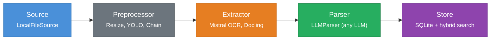

# billfox

[](https://pypi.org/project/billfox/)
[](https://www.python.org/downloads/)
[](LICENSE)
[](https://github.com/billfox-ai/billfox/actions)

**AI-agent-friendly receipt management** -- extract, parse, store, and search receipts and invoices with composable pipelines built for LLM workflows.

billfox is a Python library for building document processing pipelines from independent, swappable stages. Load a document, preprocess it, OCR the text, parse it with any LLM into structured data, and store it with hybrid vector search -- each stage implements a simple protocol, so you can mix built-in modules with your own.

## How It Works



Every boundary is a **protocol** -- implement `DocumentSource`, `Preprocessor`, `Extractor`, `Parser[T]`, `Embedder`, or `DocumentStore[T]` to plug in your own components.

| Stage        | Protocol          | Built-in                                              |
|--------------|-------------------|-------------------------------------------------------|
| Source       | `DocumentSource`  | `LocalFileSource`                                     |
| Preprocessor | `Preprocessor`    | `ResizePreprocessor`, `YOLOPreprocessor`, `PreprocessorChain` |
| Extractor    | `Extractor`       | `MistralExtractor`, `DoclingExtractor`                |
| Parser       | `Parser[T]`       | `LLMParser[T]`                                        |
| Embedder     | `Embedder`        | `OpenAIEmbedder`                                      |
| Store        | `DocumentStore[T]`| `SQLiteDocumentStore[T]`                              |

## Installation

```bash
pip install billfox                    # Core only (types and protocols)
pip install 'billfox[mistral]'         # + Mistral OCR
pip install 'billfox[llm]'             # + LLM parsing (pydantic-ai)
pip install 'billfox[store]'           # + SQLite storage and search
pip install 'billfox[all]'             # Everything
```

<details>
<summary>All available extras</summary>

| Extra          | Packages                                  | Use case                       |
|----------------|-------------------------------------------|--------------------------------|
| `mistral`      | `mistralai`                               | Mistral OCR extraction         |
| `yolo`         | `onnxruntime`, `numpy`, `Pillow`          | YOLO document cropping         |
| `llm`          | `pydantic-ai`                             | LLM structured parsing         |
| `openai`       | `openai`                                  | OpenAI text embeddings         |
| `anthropic`    | `anthropic`                               | Anthropic LLM support          |
| `store`        | `sqlalchemy`, `aiosqlite`, `sqlite-vec`   | SQLite storage + search        |
| `google-drive` | `google-api-python-client`, `google-auth` | Google Drive backup            |
| `cli`          | `typer`, `rich`, `tomli-w`                | Command-line interface         |
| `all`          | All of the above                          | Everything                     |

</details>

## Quick Start

### Extract Markdown from a Document (OCR only)

```python
import asyncio
from billfox.source import LocalFileSource
from billfox.extract import MistralExtractor

async def main():
    source = LocalFileSource()
    extractor = MistralExtractor()  # uses MISTRAL_API_KEY env var

    doc = await source.load("invoice.pdf")
    result = await extractor.extract(doc)
    print(result.markdown)

asyncio.run(main())
```

### Full Pipeline -- OCR + LLM Parse + Store

```python
import asyncio
from pydantic import BaseModel
from billfox import Pipeline
from billfox.source import LocalFileSource
from billfox.extract import MistralExtractor
from billfox.parse import LLMParser
from billfox.preprocess import ResizePreprocessor
from billfox.store import SQLiteDocumentStore

class Invoice(BaseModel):
    vendor_name: str
    total: float
    date: str

async def main():
    pipeline = Pipeline(
        source=LocalFileSource(),
        extractor=MistralExtractor(),
        parser=LLMParser(
            model="openai:gpt-4.1",
            output_type=Invoice,
            system_prompt="Extract invoice fields from this document.",
        ),
        preprocessors=[ResizePreprocessor(max_side=1024)],
        store=SQLiteDocumentStore(db_path="invoices.db", schema=Invoice),
    )

    invoice = await pipeline.run("scan.jpg", document_id="inv-001")
    print(f"{invoice.vendor_name}: ${invoice.total}")

asyncio.run(main())
```

### CLI

```bash
# Configure API keys
billfox config set api_keys.mistral sk-...

# Extract markdown via OCR
billfox extract receipt.jpg

# Parse into structured JSON
billfox parse receipt.jpg --schema ./models.py:Receipt --model openai:gpt-4.1

# Search stored documents
billfox search "coffee" --db invoices.db
```

## Extending billfox

Every stage is a Python protocol. Implement the method, pass it to `Pipeline`, done.

### Custom Extractor

```python
from billfox._types import Document, ExtractionResult, Page
from billfox.extract import Extractor

class MyExtractor:
    async def extract(self, document: Document) -> ExtractionResult:
        text = await call_my_ocr_service(document.content)
        return ExtractionResult(
            markdown=text,
            pages=[Page(index=0, markdown=text)],
            metadata={},
        )
```

### Custom Preprocessor

```python
from billfox._types import Document
from billfox.preprocess import Preprocessor

class GrayscalePreprocessor:
    async def process(self, document: Document) -> Document:
        if not document.mime_type.startswith("image/"):
            return document  # pass through non-images
        gray_bytes = convert_to_grayscale(document.content)
        return Document(
            content=gray_bytes,
            mime_type=document.mime_type,
            source_uri=document.source_uri,
            metadata={**document.metadata, "preprocessor": "grayscale"},
        )
```

### Custom Store

```python
from billfox.store import DocumentStore

class MyStore:
    async def save(self, document_id: str, data: T) -> None: ...
    async def get(self, document_id: str) -> T | None: ...
    async def search(self, query: str, *, limit: int = 20) -> list[SearchResult]: ...
    async def delete(self, document_id: str) -> None: ...
```

See the full [documentation](docs/) for more examples:
- [Getting Started](docs/getting-started.md)
- [Custom Extractor](docs/custom-extractor.md)
- [Custom Preprocessor](docs/custom-preprocessor.md)
- [Storage and Search](docs/storage-and-search.md)

## Core Types

All core types are **frozen dataclasses** (immutable after creation):

```python
Document(content=b"...", mime_type="image/jpeg", source_uri="receipt.jpg", metadata={})
ExtractionResult(markdown="...", pages=[Page(index=0, markdown="...")], metadata={})
SearchResult(document_id="inv-001", data={...}, score=0.95, signals={...})
```

## Development

### Prerequisites

- Python 3.11+
- Git

### Setup

```bash
git clone https://github.com/billfox-ai/billfox.git
cd billfox
python -m venv .venv && source .venv/bin/activate
pip install -e ".[dev]"
```

The `dev` extra installs all optional dependencies plus `pytest`, `mypy`, `ruff`, and `coverage`.

### Commands

```bash
make test        # Run tests
make lint        # Lint with ruff
make format      # Auto-format with ruff
make typecheck   # Type check with mypy (strict)
```

### Project Structure

```
src/billfox/
  __init__.py          # Re-exports: Pipeline, Document, ExtractionResult, SearchResult
  _types.py            # Core frozen dataclasses
  _version.py          # Version string
  pipeline.py          # Pipeline compositor
  source/              # Document loading (LocalFileSource)
  preprocess/          # Image preprocessing (resize, YOLO, chain)
  extract/             # OCR / text extraction (Mistral, Docling)
  parse/               # LLM structured parsing
  embed/               # Text embeddings (OpenAI)
  store/               # SQLite storage + hybrid search (BM25 + vector + RRF)
  backup/              # Document backup (local, Google Drive)
  models/              # Pre-built Pydantic models (Receipt)
  cli/                 # Typer CLI application
tests/                 # pytest suite (26 test files)
docs/                  # mkdocs-material documentation
```

### Code Style

- **Formatter/linter**: [ruff](https://docs.astral.sh/ruff/) (120 char line length)
- **Type checker**: [mypy](https://mypy-lang.org/) in strict mode
- Type annotations on all public functions
- Google-style docstrings on public classes/functions
- `from __future__ import annotations` in all source files (except CLI modules -- typer requires runtime annotations)
- Protocols live in `_base.py` files with `@runtime_checkable`
- Lazy imports for optional dependencies with clear `ImportError` messages

### Adding a New Module

1. Create a `_base.py` protocol if introducing a new stage
2. Implement the protocol in a new file
3. Re-export in the subpackage `__init__.py`
4. Add optional dependencies to `pyproject.toml` under a new extra
5. Write tests with mocked external dependencies
6. Add a documentation page under `docs/`

## Contributing

See [CONTRIBUTING.md](CONTRIBUTING.md) for the full guide. The short version:

1. Fork and create a feature branch from `main`
2. Implement with tests
3. Run `make lint && make typecheck && make test`
4. Submit a PR

## License

MIT -- see [LICENSE](LICENSE) for details.
